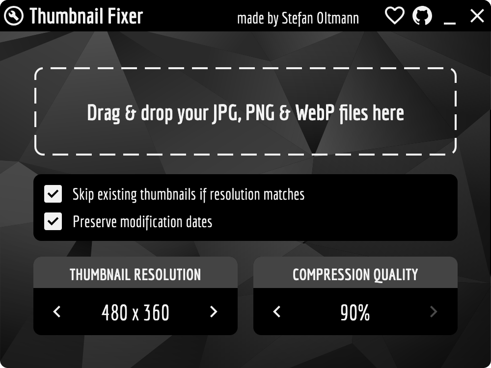

# 🔧 Thumbnail Fixer 🔧

This tool is designed to repair and enhance embedded thumbnails in images.

## Use case

Embedded thumbnails improve the performance of applications like
Windows Explorer, Apple Finder,
[Ashampoo Photo Organizer](https://ashampoo.com/photo-organizer),
Mylio, ACDSee, and many more.

Contemporary tools such as Ashampoo Photo Organizer may even opt
not to generate their own thumbnails if the embedded ones are of
sufficient quality, thereby saving computing power.

To meet Ashampoo Photo Organizer's requirements, ensure that
thumbnails are at least 480 x 360 pixels (which is the tools default).

#### Performance

On a Core i7-9700K, processing a set of 18,000 test photos using a single core
(~25% CPU utilization) took approximately 21 minutes. RAM usage averaged 1 GB,
with a peak of 2 GB. The data was read from and written to an internal M.2 SSD.

## Screenshots

Currently, on Windows, the app appears different due to a bug in
Compose Multiplatform that prevents undecorated windows from
displaying correctly. Once the issue is resolved, the undecorated
design will be restored.

## Installation

For Windows, it is recommended to use the version available in the [Microsoft Store](https://apps.microsoft.com/detail/9N0KK665LRMB) as this version is properly signed.

If you prefer to avoid the Microsoft Store, you can download a self-signed installer [here](https://github.com/stefanoltmann/thumbnail-fixer/releases/download/1.0.5/thumbnail-fixer-1.0.5.x64.msix).

For alternative installation options, including a macOS version, [click here](https://stefan-oltmann.de/thumbnail-fixer/download.html).

## Used tech

The app is built using [Kotlin](https://kotlinlang.org)
with [Compose Multiplatform](https://www.jetbrains.com/de-de/compose-multiplatform/).

Key libraries utilized in this project include [libvips](https://github.com/libvips/)
(via [vips-ffm](https://github.com/lopcode/vips-ffm)) for efficient thumbnail creation
and [Ashampoo Kim](https://github.com/ashampoo/kim) for convenient metadata handling.

## Acknowledgements

* JetBrains for making [Kotlin](https://kotlinlang.org).
* John Cupitt for making [libvips](https://github.com/libvips/).
* carrot for making [vips-ffm](https://github.com/lopcode/vips-ffm).
* Mike Hearn for making [Hydraulic Conveyor](https://conveyor.hydraulic.dev).
* Yahor for making the [Valkyrie IDEA plugin](https://github.com/ComposeGears/Valkyrie).

## Contributions

Contributions to this project are welcome! If you encounter any issues,
have suggestions for improvements, or would like to contribute new features,
please feel free to submit a pull request.

## Licenses

Thumbnail Fixer is distributed under the GNU General Public License (GPL),
guaranteeing the community the freedom to use, modify, and share the software.

Icons are sourced from Google Material Design, except for the GitHub icon,
which is designed by Icons8.

The font used is licensed under the SIL Open Font License (OFL).

The [background image](https://www.freepik.com/free-vector/geometric-background_3730424.htm) was made by Freepik.
